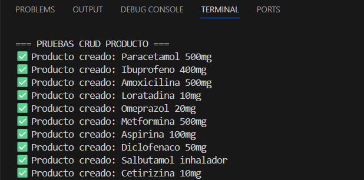
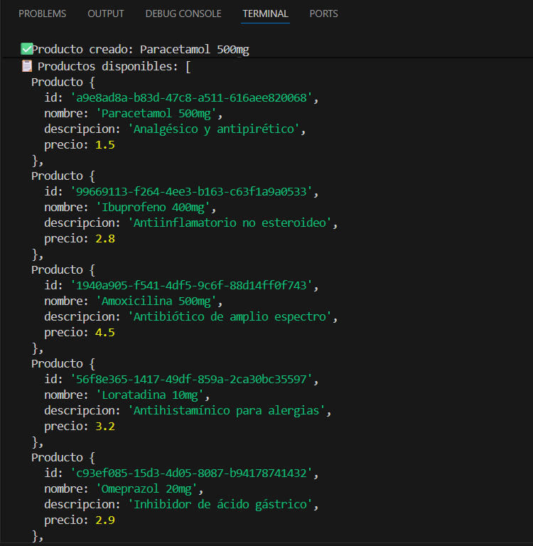
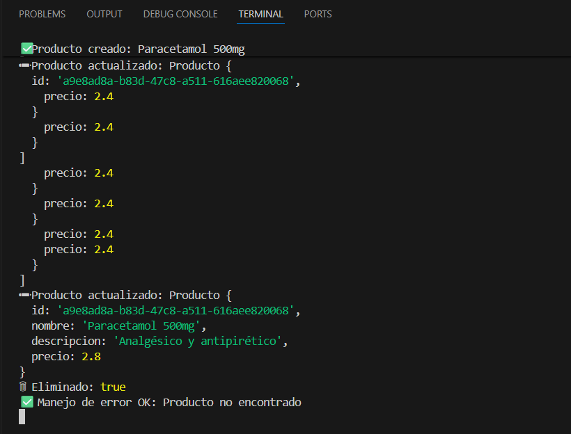

# Práctica en Clases #2 - Arquitectura del Dominio con Métodos Asíncronos y Patrones de Programación

## Integrantes y Contribuciones

* **Ruddy Paúl Pico Quijije** → Entidad Cliente
* **Robinson Omar Moreira Delgado** → Entidad Producto
* **Diego Sebastian Casanova Castro** → Entidad Y

---

## Arquitectura del Sistema

El proyecto sigue la Arquitectura en Capas:

* Domain → Definición de la entidad `Producto` y sus validaciones.

* Infrastructure → Repositorio en memoria con operaciones CRUD.

* Application → Servicios con lógica de negocio y pruebas de CRUD.

* Presentation → Punto de entrada `main.ts` con ejecución de pruebas e integración.

Se aplican patrones y conceptos:

* Repository Pattern → Abstracción del acceso a datos.

* Dependency Inversion + Inyección de Dependencias → El servicio depende de la interfaz `IProductoRepository`.

* Principio SOLID (SRP, DIP) → Separación de responsabilidades.

* Domain-Driven Design (DDD) → Entidad `Producto` con reglas de negocio propias.

```bash
PRACTICA2/
│── evidencias
│   │──evidencia1.png
│   │──evidencia2.png
│   │──evidencia3.png
│
│── node_modules/
│── src/
│   │── application/
│   │   │── services/
│   │       │── ProductoService.ts
│   │
│   │── domain/
│   │   │── entities/
│   │   │   │── Producto.ts
│   │   │
│   │   │── interfaces/
│   │       │── IProductoRepository.ts
│   │
│   │── infrastructure/
│   │   │── repositories/
│   │       │── ProductoRepository.ts
│   │
│   │── presentation/
│       │── main.ts
│
│── .gitignore
│── package-lock.json
│── package.json
│── README.md
│── tsconfig.json
```

---

## Instrucciones de Instalación

### 1. Clonar el repositorio

```bash
 git clone https://github.com/Robin0980robin/PRACTICAS.git
 cd practica2
```

### 2. Instalar dependencias

```bash
 npm install
```

## Instrucciones de Ejecución

* Modo desarrollo:

```bash
 npm run dev
```

* Modo producción:

```bash
 npm run build
 npm start
```

---

## Documentación de APIs

En esta práctica se desarrolló un CRUD de Producto que expone la siguiente interfaz a través del repositorio y servicio:

* create(producto, callback) → Inserta un producto (callback)

* findAll() → Devuelve todos los productos (async/await)

* findById(id) → Busca producto por id (async/await)

* update(id, data) → Actualiza un producto (promise)

* delete(id) → Elimina un producto (async/await)

---

## Paradigmas Implementados

* Callbacks → Crear producto

* Promises → Actualizar producto

* Async/Await → Leer y eliminar productos

---

## Evidencias de Funcionamiento

### Evidencia 1: Creación de 10 productos


### Evidencia 2: Listado de productos


### Evidencia 3: Update, Delete y manejo de error


---

## Conclusiones Individuales

>En esta práctica reforcé el uso de la asincronía en Node.js aplicando distintos paradigmas como callbacks, promises y async/await en un mismo CRUD, lo que me permitió comprender mejor cómo manejar procesos asíncronos. También entendí la importancia de organizar el código en capas para mantenerlo más claro y fácil de mantener, además de aplicar principios SOLID mediante la inyección de dependencias. Reconocí que el manejo adecuado de errores es fundamental para garantizar la consistencia de la aplicación, y confirmé que trabajar con TypeScript es de gran ayuda para detectar problemas de tipado antes de ejecutar el programa.